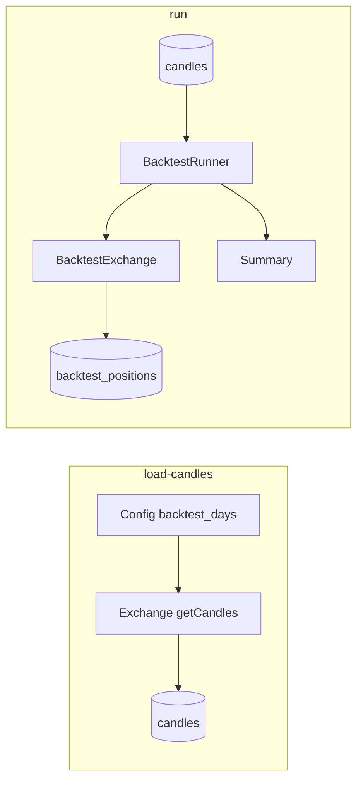

# План: команды load-candles и run для бэктестинга

## Текущее состояние

- Уже есть заглушка: [tasks/backtesting/load-candles](tasks/backtesting/load-candles) вызывает `Backtester::getInstance()->run()`; [lib/Izzy/RealApplications/Backtester.php](lib/Izzy/RealApplications/Backtester.php) только выводит "OK".
- В конфиге уже используется атрибут `backtest_days` на стратегии ([config/config.xml.example](config/config.xml.example), строка 22), но парсер конфига его не читает.
- Биржа (Bybit) умеет отдавать свечи по `getCandles(IPair $pair, int $limit, ?int $startTime, ?int $endTime)`; лимит до 1000, время в миллисекундах.
- Торговая логика: [Market::processTrading()](lib/Izzy/Financial/Market.php) → strategy->shouldLong()/shouldShort() → handleLong()/handleShort(); позиции хранятся в таблице `positions` через [StoredPosition](lib/Izzy/Financial/StoredPosition.php).

## Архитектура решения

## 1. Конфигурация: backtest_days и список пар для бэктеста

- **ExchangeConfiguration**: в [parseStrategyConfig](lib/Izzy/Configuration/ExchangeConfiguration.php) добавить чтение атрибута `backtest_days` у элемента `<strategy>` (опционально, целое число). Возвращать в массиве конфига ключ `backtest_days` (int|null).
- **Pair**: добавить свойство и методы `getBacktestDays(): ?int`, `setBacktestDays(?int): void`. В [getSpotPairs](lib/Izzy/Configuration/ExchangeConfiguration.php) / getFuturesPairs при разборе стратегии вызывать `$pair->setBacktestDays($strategyConfig['backtest_days'] ?? null)`.
- **Configuration**: новый метод `getPairsForBacktest(): array` — обойти все включённые биржи, собрать spot/futures пары и вернуть только те, у которых `getBacktestDays() !== null`. Формат: массив пар с привязкой к бирже (например, массив структур с exchangeName, pair, exchangeConfig).

## 2. Хранение свечей в БД

- **Миграция**: новая таблица `candles` с префиксом полей `candle_`:
  - `candle_id` (AUTO_INCREMENT PRIMARY KEY)
  - `candle_exchange_name` VARCHAR(50)
  - `candle_ticker` VARCHAR(20)
  - `candle_market_type` ENUM('spot','futures')
  - `candle_timeframe` VARCHAR(10) — значение enum timeframe, например '4h'
  - `candle_open_time` INT UNSIGNED (Unix timestamp)
  - `candle_open`, `candle_high`, `candle_low`, `candle_close` DECIMAL(20,8)
  - `candle_volume` DECIMAL(20,8)
  - UNIQUE KEY по (exchange, ticker, market_type, timeframe, open_time) для идемпотентной вставки
- **Класс для доступа к свечам**: например `CandleRepository` в `lib/Izzy/System/Database/` или в `lib/Izzy/Financial/` — методы:
  - `saveCandles(string $exchange, string $ticker, string $marketType, string $timeframe, array $candles): void` — вставка батчами (INSERT IGNORE или ON DUPLICATE KEY UPDATE по уникальному ключу), свечи — массив объектов ICandle или массивов с ключами open_time, open, high, low, close, volume.
  - `getCandles(IPair $pair, int $startTime, int $endTime): array` — выборка по (exchange, ticker, market_type, timeframe) и `candle_open_time` между startTime и endTime, ORDER BY candle_open_time ASC; возвращать массив объектов Candle (без привязки к Market — Market можно задать позже при прогоне).

Создание миграции через `tasks/db/create-migration` (например имя `candles-table`).

## 3. Задача tasks/backtesting/load-candles

- Скрипт оставить как есть (вызов Backtester), логику перенести в Backtester или в отдельный класс `LoadCandlesCommand`/метод `Backtester::loadCandles()`.
- Логика:
  - Загрузить конфиг, открыть БД, подключить биржи (как Trader — только enabled).
  - Получить `getPairsForBacktest()`.
  - Для каждой пары: `backtest_days = $pair->getBacktestDays()`, интервал: `endTime = time() * 1000` (мс), `startTime = endTime - backtest_days * 24 * 3600 * 1000`.
  - Запрашивать у биржи свечи чанками по 1000 через `getCandles($pair, 1000, $chunkStart, $chunkEnd)`, пока не покроем [startTime, endTime] (Bybit принимает start/end в мс).
  - Сохранять чанки в БД через CandleRepository::saveCandles (параметры: exchange, ticker, market_type, timeframe, массив свечей). Конвертировать timestamp свечи в секунды при сохранении в БД (candle_open_time в секундах удобнее для выборки).
- Вывод: по каждой паре — сколько свечей загружено/добавлено, при ошибках — логировать и продолжать остальные пары.

## 4. Задача tasks/backtesting/run

- Новый исполняемый файл [tasks/backtesting/run](tasks/backtesting/run) (без расширения, как у migrate/load-candles), shebang и require common.php, вызов класса бэктеста (например `Backtester::getInstance()->runBacktest()` или отдельный `RunBacktestCommand`).
- Логика бэктеста (упрощённо, без проскальзывания и комиссий):
  - Получить пары для бэктеста; для каждой пары загрузить из БД свечи за период (start = now - backtest_days, end = now) через CandleRepository.
  - Для каждой пары (и при необходимости для каждой биржи): создать «виртуальное» окружение:
    - **BacktestExchange** (реализует IExchangeDriver): не ходит в API; getCandles() возвращает переданный массив свечей (или пустой, т.к. свечи будем подставлять в Market вручную); getCurrentPrice(Market) возвращает цену «текущей» свечи (задаётся извне перед каждым шагом); openPosition/placeLimitOrder/buyAdditional/sellAdditional — записывают «сделку» и создают/обновляют запись в таблице **backtest_positions** (та же схема, что у `positions`), не вызывая API; getDatabase() возвращает тот же Database; getCurrentFuturesPosition() и т.п. — возвращать по данным из backtest_positions.
    - Таблица **backtest_positions**: миграция с той же структурой, что и `positions` (можно скопировать из актуальной миграции positions). В начале run очищать (TRUNCATE или DELETE).
    - **BacktestStoredPosition**: класс-наследник StoredPosition с `getTableName(): string { return 'backtest_positions'; }`. Все создания позиций в бэктесте должны создавать BacktestStoredPosition и сохранять в backtest_positions.
    - **Market**: при создании маркета для бэктеста после создания вызывать setter, чтобы getStoredPosition() использовал BacktestStoredPosition::class вместо StoredPosition::class (т.е. в [Market](lib/Izzy/Financial/Market.php) добавить опциональное свойство `$positionRecordClass` и в getStoredPosition() использовать его для selectOneObject; по умолчанию StoredPosition::class).
  - Начальный баланс: константа или параметр конфига (например 10000 USDT). Хранить в BacktestExchange текущий виртуальный баланс; при открытии позиции списывать объём в quote, при закрытии — зачислять (упрощённо: без комиссий и проскальзывания).
  - Цикл по свечам (по индексу i от 0 до N-1):
    1. Установить в Market свечи с 0 по i включительно: `market->setCandles(array_slice($candles, 0, i + 1))` и для каждой свечи setMarket($market).
    2. Установить в BacktestExchange «текущую цену» для этого маркета = close текущей свечи (и при необходимости текущее время).
    3. Вызвать `market->calculateIndicators()`, затем `market->processTrading()` — стратегия может открыть позицию (она попадёт в backtest_positions).
    4. Проверить срабатывание TP по текущей свече: для каждой открытой позиции этого маркета в backtest_positions — если (long и high >= TP price) или (short и low <= TP price), закрыть позицию (status = FINISHED, обновить баланс).
  - После прохода по всем свечам собрать сводку из backtest_positions и баланса и вывести в консоль.

## 5. Детали реализации

- **Market::getStoredPosition()**: использовать конфигурируемый класс записи позиции. Добавить в Market свойство `protected string $positionRecordClass = StoredPosition::class` и метод `setPositionRecordClass(string $class): void`. В getStoredPosition() вызывать `$this->database->selectOneObject($this->positionRecordClass, $where, $this)`.
- **BacktestExchange**: не наследовать от Bybit (чтобы не тянуть API). Реализовать IExchangeDriver с минимальной логикой: getDatabase(), getLogger(), getName(), getExchangeConfiguration(), createMarket() (создать Market, затем вызвать setPositionRecordClass(BacktestStoredPosition::class)), getCurrentPrice() — из внутреннего хранилища «текущая цена по маркету»; getCandles() — возвращать пустой массив или переданный при инициализации; openPosition/placeLimitOrder — создавать BacktestStoredPosition::create(...), save(), обновлять виртуальный баланс; removeLimitOrders/setTakeProfit — no-op или заглушка; остальные методы — минимальные заглушки (getSpotBalanceByCurrency возвращать Money из текущего баланса и т.д.). createMarket не должен запрашивать свечи с биржи — свечи вызывающий код подставит через setCandles после создания маркета.
- **Закрытие по TP в бэктесте**: в цикле после processTrading() для данного маркета получить открытые позиции из backtest_positions (по exchange, ticker, market_type), для каждой проверить по high/low текущей свечи достижение TP, обновить позицию (status FINISHED, position_finished_at) и пересчитать баланс (реализованная PnL в quote).
- **Сводка в конце run**: количество трейдов (записей в backtest_positions со status FINISHED + открытые на конец), начальный баланс, конечный баланс, при желании — список закрытых позиций с entry/exit/PnL. Вывод в echo/logger.

## 6. Порядок файлов и изменений

| Компонент                      | Действие                                                                                                                                                                  |
| ------------------------------ | ------------------------------------------------------------------------------------------------------------------------------------------------------------------------- |
| Миграция candles               | `tasks/db/create-migration` → создать таблицу candles с полями и UNIQUE ключом                                                                                            |
| Миграция backtest_positions    | Вторая миграция — таблица backtest_positions (копия актуальной positions)                                                                                                 |
| ExchangeConfiguration          | Парсинг backtest_days, передача в Pair                                                                                                                                    |
| Pair                           | getBacktestDays/setBacktestDays                                                                                                                                           |
| Configuration                  | getPairsForBacktest()                                                                                                                                                     |
| CandleRepository (новый)       | saveCandles, getCandles                                                                                                                                                   |
| Backtester                     | loadCandles(): пары для бэктеста, запрос к бирже чанками, сохранение через CandleRepository                                                                               |
| BacktestStoredPosition (новый) | extends StoredPosition, getTableName() = backtest_positions                                                                                                               |
| BacktestExchange (новый)       | IExchangeDriver, виртуальный баланс, запись в backtest_positions                                                                                                          |
| Market                         | positionRecordClass + setPositionRecordClass + использование в getStoredPosition                                                                                          |
| Run backtest                   | Backtester::runBacktest() или отдельный класс: загрузка свечей из БД, цикл по свечам, создание BacktestExchange и Market, вызов processTrading и проверка TP, сбор сводки |
| tasks/backtesting/load-candles | Оставить вызов Backtester, внутри вызывать loadCandles()                                                                                                                  |
| tasks/backtesting/run          | Новый файл, вызов runBacktest()                                                                                                                                           |

## 7. Важные моменты

- Временной диапазон для загрузки и для прогона задаётся из конфига: `backtest_days` на элементе `<strategy>` (в днях). Для run период брать тот же (последние N дней от текущей даты при загрузке свечей; при run читать те же данные из БД).
- По конвенциям проекта: табы, type hints, Money для сумм, префиксы колонок (candle_*, position_*), enum через ->value при записи в БД, комментарии на английском.
- Не симулировать комиссии и проскальзывание — только исполнение по цене close (или open) текущей свечи и закрытие по TP по high/low.

